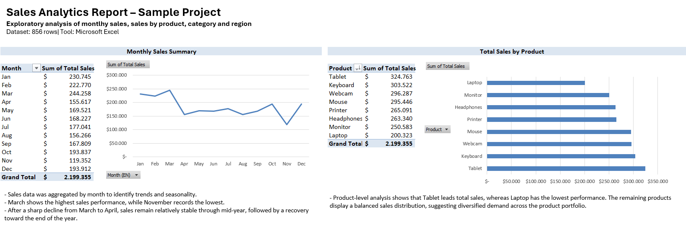
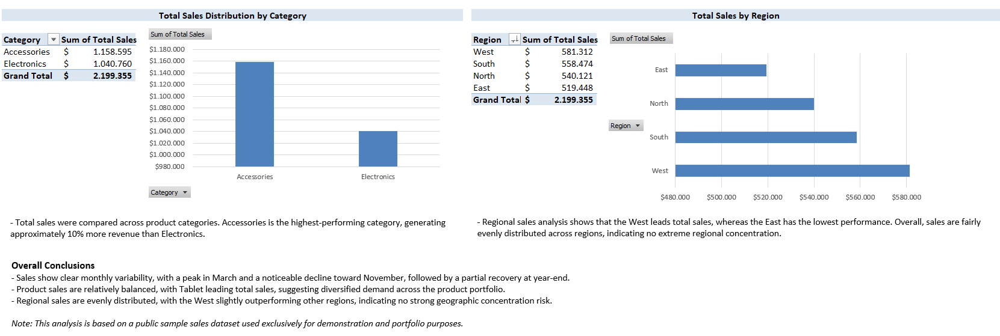
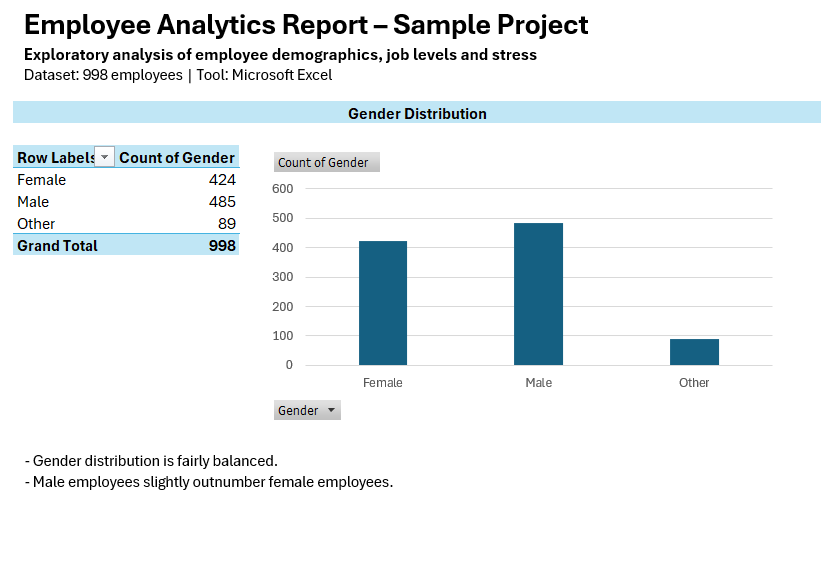
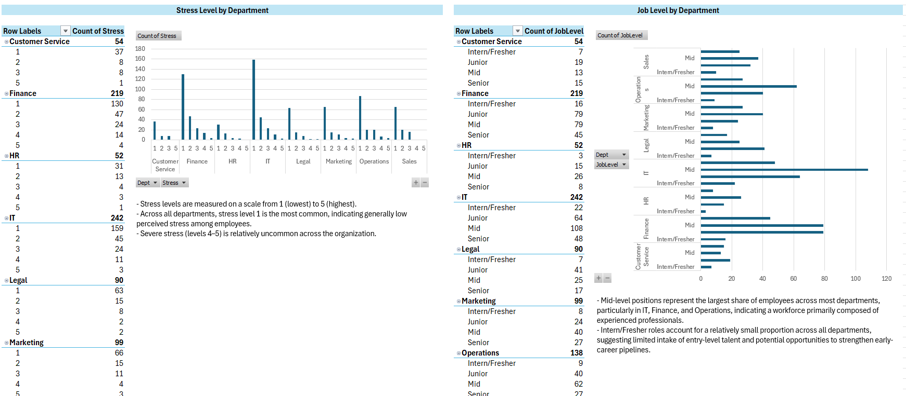
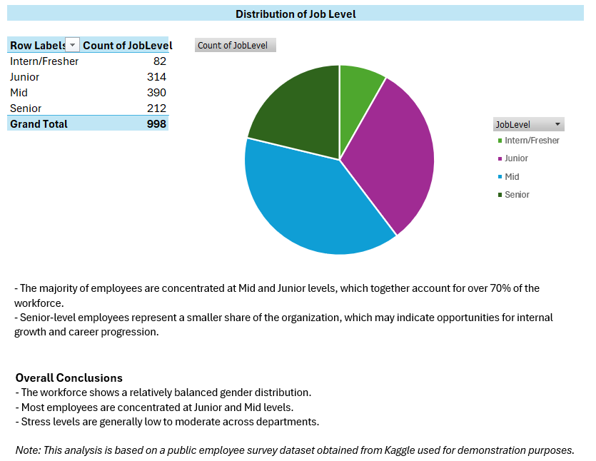
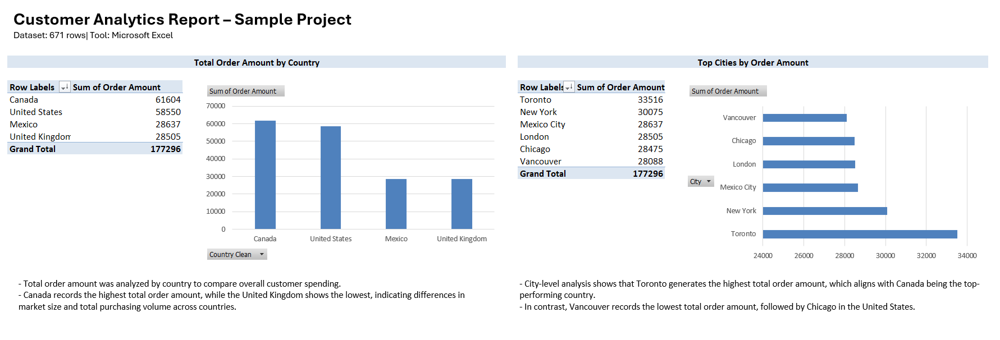
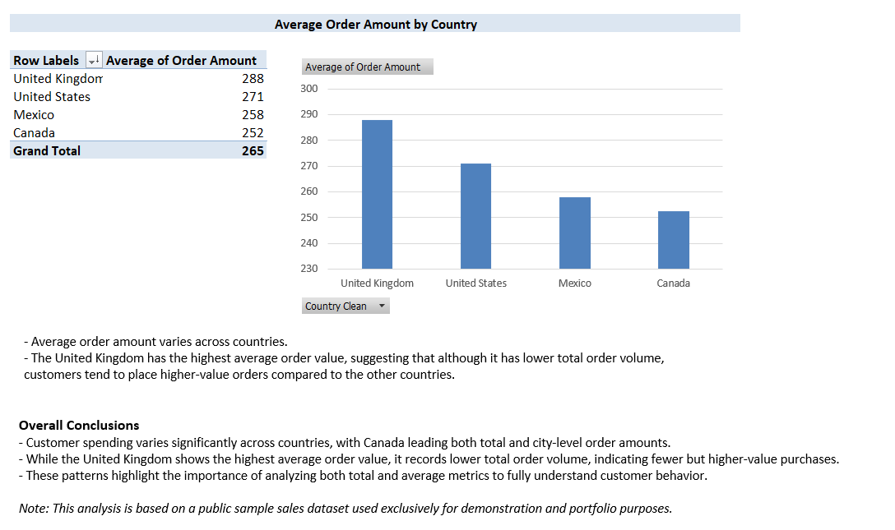

# Excel Data Analytics Portfolio

## 🇬🇧 English

A collection of Excel-based analytics reports showcasing pivot tables, charts, and business insights using public sample datasets.

**Projects**
- **Employee Analytics (Survey):** Gender, job levels, and stress analysis  
- **Sales Analytics:** Monthly trends and performance by product, category, and region  
- **Customer Analytics:** Order amount and average order value by country and city  

**Tools**
- Microsoft Excel

**Notes**
All datasets used are public and were analyzed exclusively for demonstration and portfolio purposes.

## 🇪🇸 Español
Esta es una colección de reportes analiticos en excel usando tablas dinámicas, gráficos, y insights de negocio realizado a partir de datasets públicos. Los proyectos están en inglés. 

**Proyectos**
- **Employee Analytics (Survey):** Genero, Nivel de experiencia laboral y análisis del nivel de estrés.   
- **Sales Analytics:** Tendencias mensuales y comportamiento por producto, categoria y región. 
- **Customer Analytics:** Total de pedidos y promedio de pedidos por pais y ciudad.

**Herramientas**
- Microsoft Excel

**Notas**
Los datasets utilizados son públicos y fueron analizados exclusivamente para demostración.

# Previews
## Sales Analytics Report (Excel)
### Overview

### Analysis & Conclusions 

## Employee Analytics Report (Excel)
### Overview – Gender Distribution

### Stress Level by Department and Job Level by Department

### Distribution of Job Level and Overall Conclusions

## Customer Analytics Report (Excel)
### Overview – Total Order Amount & Top Cities

### Analysis & Conclusions – Average Order Amount

